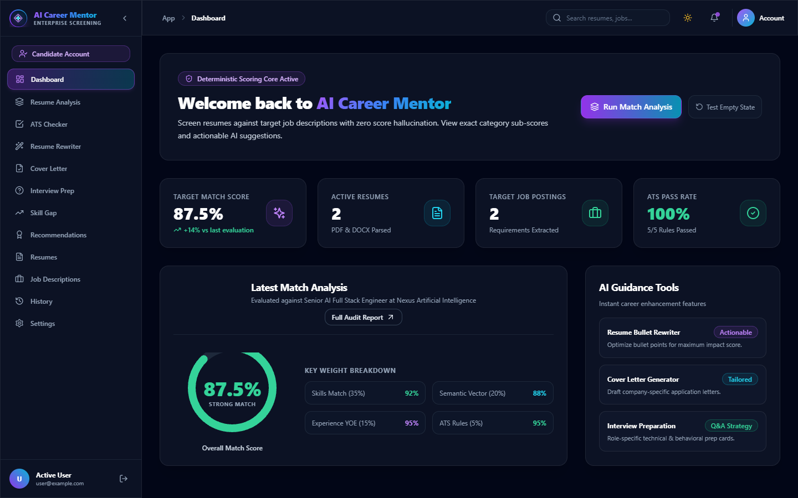
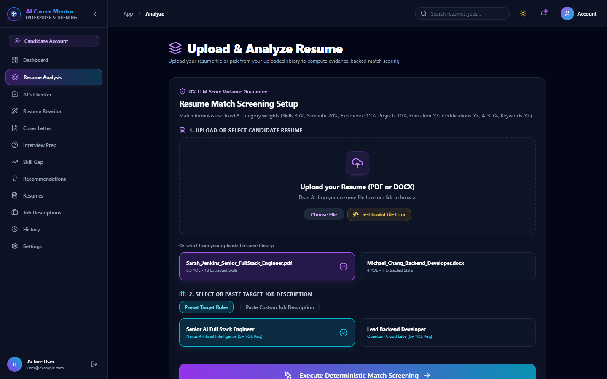
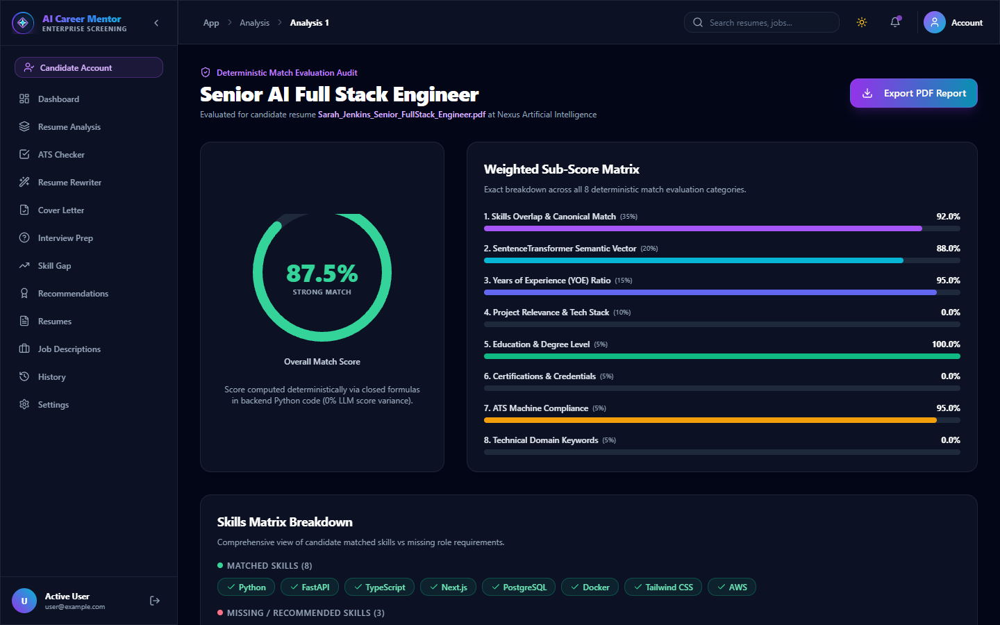
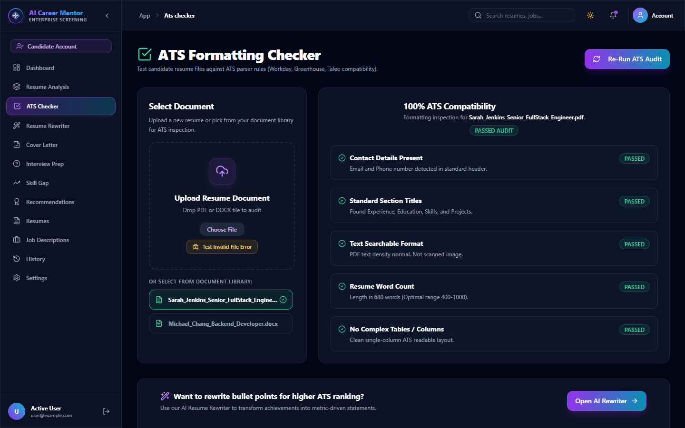
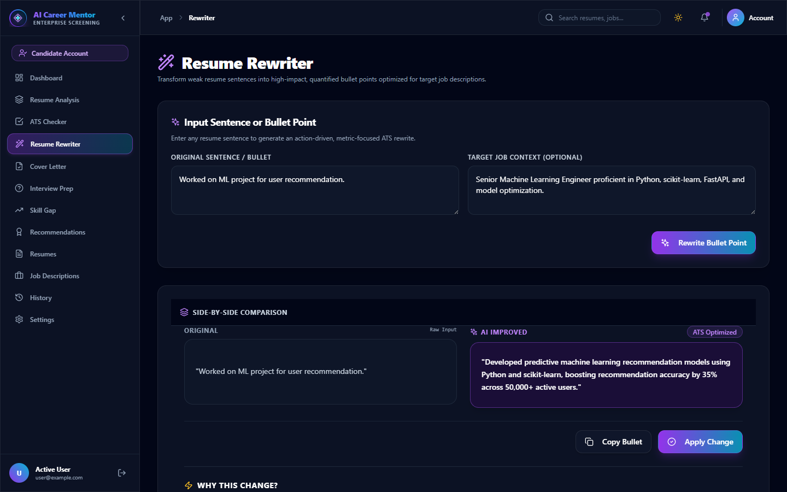
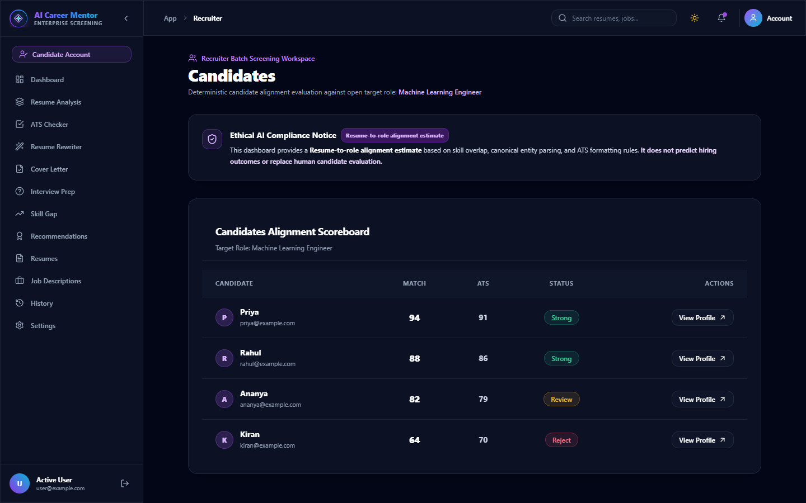

# 🎯 AI Career Mentor & Assistant Platform

> An enterprise-grade, evidence-backed AI Career Platform providing ATS optimization, explainable match scoring, grounded career recommendations, interactive resume rewriting, interview preparation, skill gap roadmaps, professional PDF reporting, and recruiter candidate management.

---

## 📸 Application Screenshots

### 1. Candidate Dashboard & Career Overview



### 2. Resume Upload & Target Role Selection



### 3. Deterministic 8-Category Match Score Matrix



### 4. ATS Formatting Rule & Parser Compliance Inspector



### 5. Side-by-Side AI Resume Bullet Rewriter



### 6. Recruiter Candidate Management Dashboard



---

## 🚀 Quick Start Guide

Follow these 5 simple steps to get the full application up and running locally using Docker:

### 1. Clone the Repository

```bash
git clone https://github.com/niharika-010/AI-Career-Mentor.git
cd AI-Career-Mentor
```

### 2. Configure Environment Variables

Copy the example environment file and customize settings if needed:

```bash
cp .env.example .env
```

### 3. Start Docker Containers

Spin up all 4 microservices (`frontend`, `backend`, `postgres`, `redis`):

```bash
docker compose up --build
```

### 4. Run Database Migrations

Once the containers are running and healthy, apply the latest database migrations:

```bash
docker compose exec backend alembic upgrade head
```

### 5. Open Application

- 🌐 **Web Frontend Interface**: [http://localhost:3000](http://localhost:3000)
- ⚡ **Backend API Documentation (Swagger)**: [http://localhost:8000/docs](http://localhost:8000/docs)
- 📊 **Health Check Endpoint**: [http://localhost:8000/api/v1/health](http://localhost:8000/api/v1/health)

---

## 🏗️ System Architecture & Services

The platform is orchestrated via `docker-compose.yml` into 4 decoupled microservices:

| Service | Technology | Port | Container Name | Description |
| :--- | :--- | :--- | :--- | :--- |
| **`frontend`** | Next.js 14, Tailwind CSS, TypeScript | `3000` | `career_frontend` | Modern interactive dashboard UI & forms |
| **`backend`** | Python 3.11, FastAPI, SQLAlchemy, Pydantic | `8000` | `career_backend` | REST API, Deterministic Scoring, & Gemini AI |
| **`postgres`** | PostgreSQL 16 Alpine | `5432` | `career_postgres` | Relational database storage |
| **`redis`** | Redis 7 Alpine | `6379` | `career_redis` | High-speed in-memory cache & rate limiter |

---

## 🛠️ Local Development (Without Docker)

### Backend Setup

```bash
cd backend
python -m venv .venv
# On Windows:
.venv\Scripts\activate
# On Linux/macOS:
source .venv/bin/activate

pip install -r requirements.txt
uvicorn app.main:app --reload --port 8000
```

### Frontend Setup

```bash
cd frontend
npm install
npm run dev
```

---

## 🧪 Running Automated Tests

### Backend Test Suite (64 Test Cases)

```bash
cd backend
pytest -v
```

### Frontend Type Check & Build Validation

```bash
cd frontend
npm run build
```

---

## 📜 License

Distributed under the MIT License.
